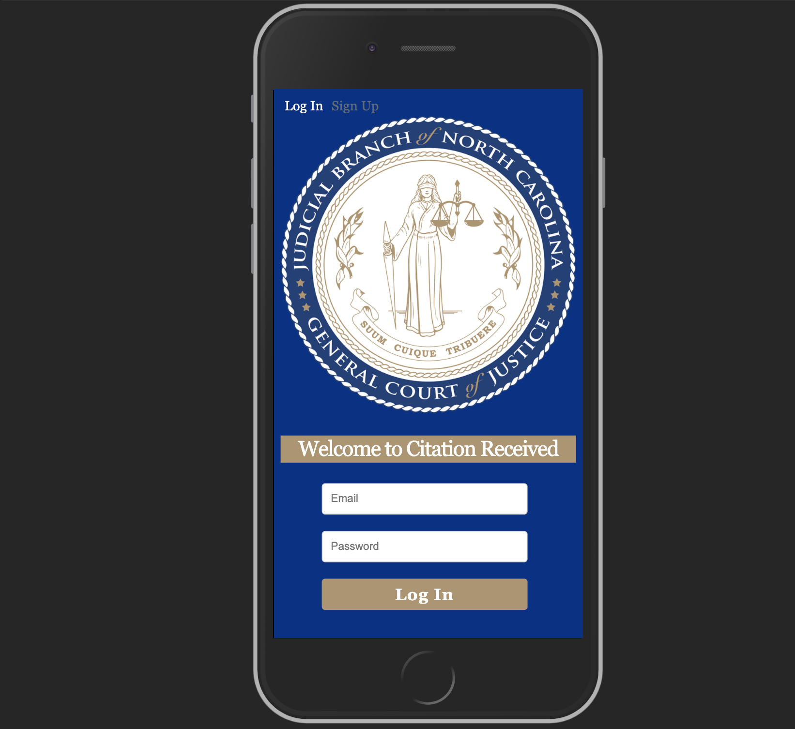

# Citation-Received
An application that will allow a defendant to pay a citation at the time of being received. This will eliminate going to court for ticketed charges that are handled with simply paying a fine. This will allow the defendant to not miss work and generate revenue faster for the Government.

